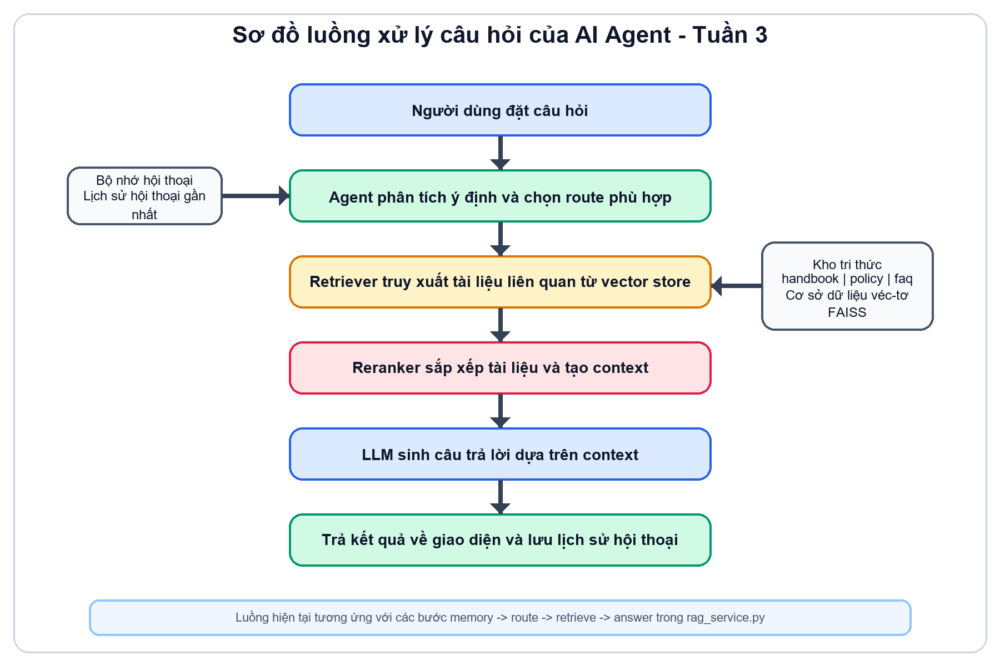
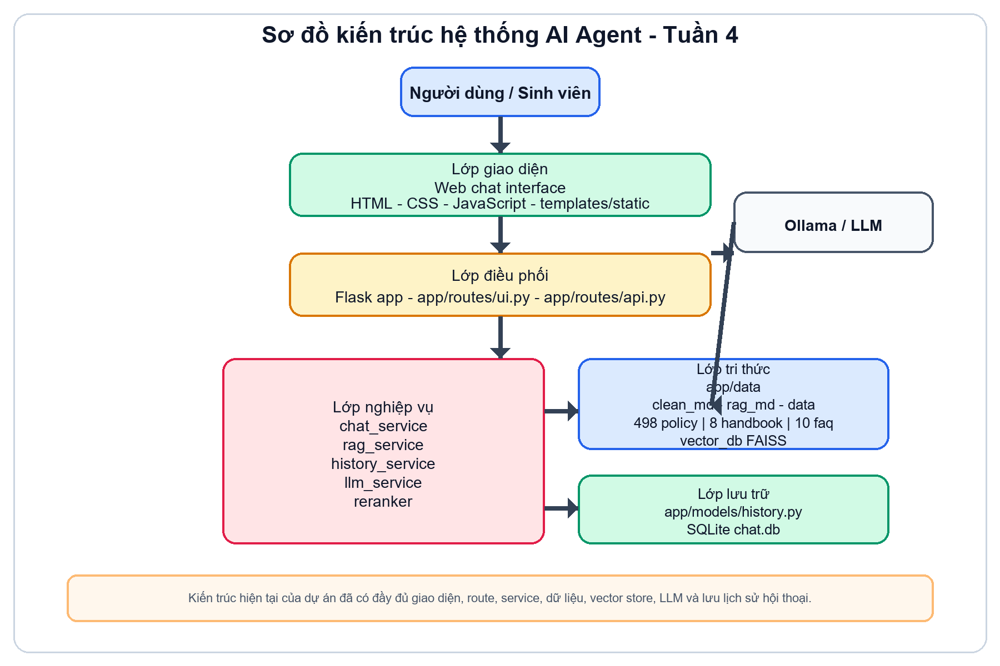

# BÁO CÁO TIẾN ĐỘ ĐỒ ÁN ĐẾN TUẦN 4

## 1. Thông tin chung

- Tên đề tài: Phát triển hệ thống hỏi đáp tự động hỗ trợ sinh viên ICTU
- Sinh viên thực hiện: Đinh Xuân Lực
- Mã sinh viên: DTC225160043
- Lớp: KHMT K21A
- Giảng viên hướng dẫn: TS. Hà Thị Thanh
- Thời gian thực hiện theo đề cương: 10 tuần, từ ngày 09/03/2026 đến ngày 22/05/2026
- Thời điểm lập báo cáo tiến độ: 31/03/2026

## 2. Căn cứ đánh giá

Báo cáo này được lập trên cơ sở đối chiếu giữa đề cương đồ án trong file PDF đã giao và hiện trạng dự án trong workspace.

Các căn cứ chính gồm:

- Đề cương đồ án quy định mục tiêu đến tuần 4 là hoàn thành phần tìm hiểu, phân tích bài toán, thiết kế luồng xử lý và thiết kế kiến trúc hệ thống AI Agent.
- Mã nguồn hiện có cho thấy dự án đã được tổ chức theo hướng Flask MVC kết hợp service layer.
- Module `app/services/rag_service.py` đã xây dựng workflow LangGraph gồm các bước memory, route, retrieve, answer.
- Module `app/data/clean_raw.py` và `app/data/pipeline.py` đã hình thành pipeline xử lý dữ liệu, tạo Knowledge Base và vector store.
- Module `app/routes/api.py`, `app/services/history_service.py`, `app/models/history.py` đã có API chat, lưu lịch sử và export TXT/PDF.
- Giao diện web đã có các trang `home`, `chat`, `history`, `vector`, `upload`, `config`.
- Kiểm tra nhanh bằng Flask test client cho thấy các route `/`, `/chat-ui`, `/history`, `/vector`, `/api/history` đều trả về mã 200.
- File `data/manifest.json` cho thấy hệ thống hiện có 498 tài liệu `policy`, 8 tài liệu `handbook`, 10 tài liệu `faq`.

## 3. Nội dung cần đạt đến hết tuần 4 theo đề cương

Theo đề cương, các mốc công việc từ tuần 1 đến tuần 4 gồm:

1. Tuần 1: Tìm hiểu tổng quan về hệ thống hỏi đáp, AI Agent, RAG, LLM.
2. Tuần 2: Phân tích bài toán, xác định các loại câu hỏi thường gặp và yêu cầu hệ thống.
3. Tuần 3: Thiết kế luồng xử lý câu hỏi của AI Agent.
4. Tuần 4: Thiết kế kiến trúc hệ thống AI Agent.

## 4. Kết quả thực hiện đến tuần 4

### 4.1. Kết quả tuần 1

Sinh viên đã tìm hiểu và lựa chọn được hướng triển khai hệ thống hỏi đáp tự động theo mô hình AI Agent kết hợp RAG và LLM. Điều này được thể hiện rõ qua việc dự án hiện đã sử dụng các thành phần LangChain, LangGraph, FAISS, Ollama và cơ chế truy xuất dữ liệu từ kho tri thức nội bộ.

Như vậy, mục tiêu của tuần 1 được đánh giá là đã hoàn thành.

### 4.2. Kết quả tuần 2

Sinh viên đã xác định tương đối rõ bài toán thực tế là hỗ trợ sinh viên ICTU tra cứu thông tin học vụ, sổ tay sinh viên, quy định, thông báo và các câu hỏi thường gặp. Hệ thống đã chia bài toán thành ba nhóm tri thức chính:

- `handbook`: sổ tay sinh viên, hướng dẫn tổng quan
- `policy`: công văn, thông báo, quyết định, quy định
- `faq`: các câu hỏi thường gặp của sinh viên

Việc phân chia này cho thấy bài toán và yêu cầu hệ thống đã được phân tích tương đối cụ thể, có định hướng rõ ràng cho việc truy xuất dữ liệu và điều phối câu trả lời.

Như vậy, mục tiêu của tuần 2 được đánh giá là đã hoàn thành.

### 4.3. Kết quả tuần 3

Luồng xử lý câu hỏi của AI Agent đã được thiết kế và hiện thực hóa khá rõ trong dự án. Trong `app/services/rag_service.py`, hệ thống đã có luồng xử lý gồm các bước:

1. Nhận câu hỏi và lấy lịch sử hội thoại gần nhất.
2. Phân tích để chọn route phù hợp.
3. Truy xuất tài liệu liên quan từ vector store.
4. Rerank dữ liệu và tạo context.
5. Gọi LLM để sinh câu trả lời.

Luồng xử lý này phù hợp với tinh thần của đề cương ở tuần 3 là thiết kế luồng xử lý cho AI Agent.

Như vậy, mục tiêu của tuần 3 được đánh giá là đã hoàn thành.

Sơ đồ luồng xử lý câu hỏi của AI Agent ở tuần 3 như sau:

### 4.4. Kết quả tuần 4

Kiến trúc hệ thống AI Agent đã được hình thành tương đối hoàn chỉnh. Dự án hiện có các thành phần chính:

- Giao diện web: `templates/`, `static/`
- Web controller và API: `app/routes/`
- Business logic: `app/services/`
- Dữ liệu và pipeline xây dựng Knowledge Base: `app/data/`
- Lưu lịch sử hội thoại: `app/models/`
- Vector store FAISS: `vector_db/`

Kiến trúc trên tương ứng khá sát với sơ đồ được nêu trong đề cương: người dùng tương tác qua web, hệ thống điều phối xử lý câu hỏi, truy xuất dữ liệu từ Knowledge Base, sau đó sử dụng LLM để sinh câu trả lời.

Như vậy, mục tiêu của tuần 4 được đánh giá là đã hoàn thành.

Sơ đồ kiến trúc hệ thống AI Agent ở tuần 4 như sau:

## 5. Đối chiếu giữa đề cương và hiện trạng dự án

Qua đối chiếu, có thể nhận thấy dự án hiện tại không chỉ đạt các mốc của tuần 1 đến tuần 4 mà còn đã triển khai trước một phần công việc của các tuần sau.

Các nội dung đã làm vượt tiến độ gồm:

- Đã xây dựng pipeline chuyển đổi dữ liệu PDF/DOCX sang markdown sạch.
- Đã có cơ chế OCR fallback cho PDF khó trích xuất.
- Đã hình thành Knowledge Base và chia dữ liệu theo nhiều route.
- Đã build vector store bằng FAISS.
- Đã tích hợp LLM qua Ollama.
- Đã có giao diện web chat và trang lịch sử hội thoại.
- Đã có chức năng export lịch sử chat sang TXT và PDF.

Tuy nhiên, vẫn còn một số nội dung cần hoàn thiện thêm để bám sát hoàn toàn đề cương:

- Bộ test tối thiểu 30 câu hỏi chưa được xây dựng thành bộ kiểm thử rõ ràng.
- Chưa có phần đánh giá định lượng hiệu quả agent.
- Trang `upload` và `config` hiện mới dừng ở mức hướng dẫn hoặc placeholder, chưa có backend đầy đủ.
- Cách tổ chức hiện tại đã có route và cơ chế truy xuất, nhưng chưa tách thành các tool độc lập theo đúng mẫu mô tả trong đề cương.
- Kho tri thức hiện nghiêng mạnh về học vụ, quy định, văn bản sinh viên; nếu muốn bám sát tuyệt đối ví dụ trong đề cương thì cần bổ sung thêm dữ liệu tuyển sinh, ngành học và điểm chuẩn.

## 6. Đánh giá tỷ lệ hoàn thành

### 6.1. So với mục tiêu cần đạt đến hết tuần 4

Nếu chỉ đối chiếu theo đúng kế hoạch từ tuần 1 đến tuần 4, tiến độ hiện tại được đánh giá là:

- Hoàn thành khoảng 100% mục tiêu đến tuần 4.

Lý do là cả bốn đầu việc chính trong đề cương đều đã có sản phẩm hoặc bằng chứng rõ ràng trong mã nguồn và kiến trúc hệ thống.

### 6.2. So với toàn bộ đồ án 10 tuần

Nếu đối chiếu với toàn bộ đề cương 10 tuần, tiến độ tổng thể của đồ án hiện tại được ước lượng khoảng:

- Hoàn thành khoảng 74% toàn bộ đồ án.

Cách ước lượng này dựa trên các nhóm nội dung sau:

- Phân tích bài toán và yêu cầu: đã hoàn thành tốt.
- Thiết kế luồng xử lý và kiến trúc: đã hoàn thành tốt.
- Knowledge Base, vector store, RAG và tích hợp LLM: đã triển khai ở mức khá đầy đủ.
- Demo web: đã có và có thể truy cập được các route chính.
- Kiểm thử, đánh giá hiệu quả agent và chuẩn hóa bộ tool: chưa hoàn thiện.

## 7. Khó khăn và tồn tại

Trong quá trình thực hiện, một số khó khăn và tồn tại có thể ghi nhận như sau:

- Dữ liệu nguồn không đồng nhất, gồm nhiều PDF và tài liệu có chất lượng trích xuất khác nhau.
- Một số nội dung trong đề cương thiên về tuyển sinh, trong khi dự án hiện tập trung mạnh hơn vào học vụ và văn bản sinh viên.
- Việc kiểm thử chất lượng trả lời của agent chưa được lượng hóa thành bộ câu hỏi chuẩn và bộ tiêu chí đánh giá rõ ràng.
- Một số chức năng hỗ trợ vận hành như upload dữ liệu trực tiếp trên giao diện chưa hoàn thiện.

## 8. Kế hoạch công việc sau tuần 4

Trong giai đoạn tiếp theo, sinh viên dự kiến tập trung vào các nội dung:

1. Tiếp tục hoàn thiện và chuẩn hóa Knowledge Base.
2. Hoàn thiện cơ chế RAG và tối ưu truy xuất dữ liệu.
3. Chuẩn hóa các tool hoặc lớp truy xuất để bám sát hơn với đề cương AI Agent.
4. Bổ sung bộ test tối thiểu 30 câu hỏi để đánh giá hệ thống.
5. Hoàn thiện bản demo và phần báo cáo đánh giá kết quả.

## 9. Kết luận

Tính đến thời điểm hết tuần 4, đồ án đã hoàn thành đầy đủ các mục tiêu theo đề cương và đang ở trạng thái vượt tiến độ. Không chỉ dừng ở mức tìm hiểu, phân tích và thiết kế, dự án hiện đã có sản phẩm chạy được với kiến trúc rõ ràng, có pipeline dữ liệu, có RAG, có vector store, có giao diện web và có chức năng lưu lịch sử hội thoại.

Vì vậy, có thể kết luận:

- Tiến độ đến hết tuần 4: đạt 100%
- Tiến độ tổng thể toàn đồ án tại thời điểm hiện tại: khoảng 74%

Sinh viên cần tiếp tục tập trung vào phần kiểm thử, đánh giá hiệu quả và hoàn thiện một số chức năng còn thiếu để tiến tới hoàn thành toàn bộ đồ án theo đúng yêu cầu.
