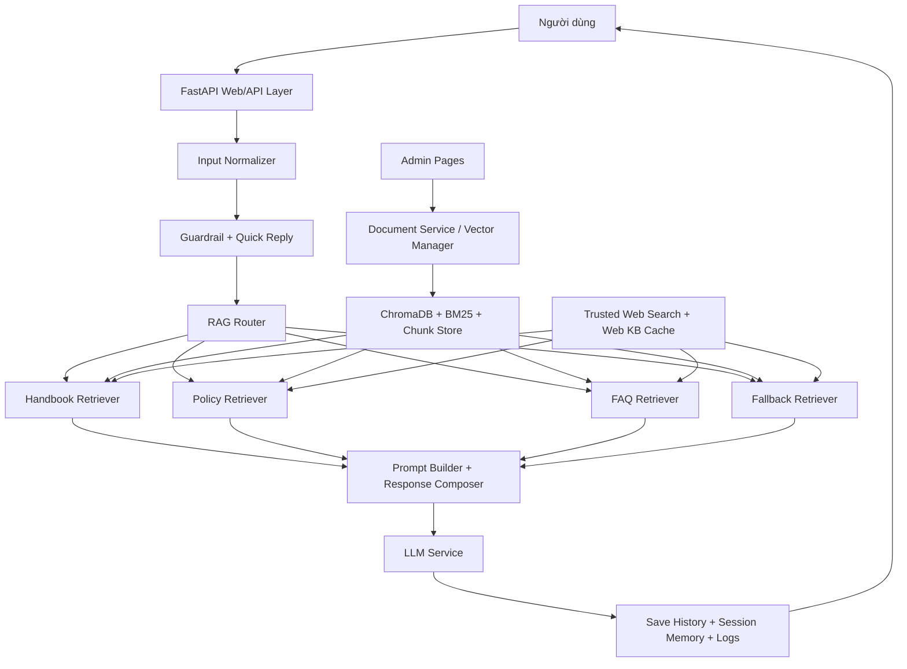

# Thiết kế chatbot tổng quát và framework xử lý ICTU

## 1. Mục đích tài liệu

Tài liệu này bổ sung chi tiết cho 2 đầu mục:

- Bản thiết kế chatbot tổng quát.
- Framework hỗ trợ cho từng bước xử lý chatbot.

Nó được viết theo code hiện tại trong repo để có thể đưa thẳng vào báo cáo, slide hoặc phần thuyết minh đồ án.

## 2. Bản thiết kế chatbot tổng quát

### 2.1 Bài toán cần giải

Chatbot cần trả lời các câu hỏi liên quan đến ICTU cho người học theo 3 nhóm tri thức chính:

- `student_handbook_rag`: sổ tay sinh viên, hướng dẫn, thông tin theo khóa và năm học.
- `school_policy_rag`: quy định, thông báo, quyết định, văn bản chính sách.
- `student_faq_rag`: hỏi đáp thường gặp, việc làm, email, tốt nghiệp, thông tin phục vụ sinh viên.

Hệ thống phải đạt 4 yêu cầu:

- Trả lời đúng phạm vi ICTU.
- Chọn đúng nhóm tri thức trước khi truy xuất.
- Ưu tiên trả lời có căn cứ thay vì sinh câu trả lời chung chung.
- Có khả năng mở rộng dần thành agent pipeline rõ ràng.

### 2.2 Tác nhân và kênh tương tác

- Người dùng: gửi câu hỏi qua Web UI hoặc REST API.
- Quản trị viên: upload tài liệu, reset/index lại kho tri thức, duyệt Q&A vào knowledge base.
- Hệ thống chatbot: nhận message, route, truy xuất, sinh câu trả lời, lưu lịch sử.
- Đội vận hành: theo dõi log, benchmark, unit test và trạng thái vector store.

### 2.3 Thành phần dữ liệu

- Corpus tài liệu gốc trong `clean_data/`.
- Corpus hỏi đáp đã chuẩn hóa trong `data/primary_corpus/`.
- Tài liệu upload thêm trong `data/rag_uploads/`.
- Vector store lưu trong `vectorstore/`.
- SQLite runtime trong `data/bot_config.db`.
- Web knowledge cache trong bảng `web_search_knowledge`.
- Session memory trong `services/vector_store_service.py::SESSION_MEMORY`.

### 2.4 Sơ đồ tổng quát

### 2.5 Thiết kế logic theo lớp

#### Lớp giao tiếp

- `config/app_factory.py`: khởi tạo ứng dụng.
- `controllers/web_controller.py`: route giao diện Web.
- `controllers/api_controller.py`: route API.
- `views/`: trả HTML và payload phản hồi.

Vai trò của lớp này là tiếp nhận yêu cầu, xác thực request, tạo session và đưa dữ liệu vào lớp điều phối.

#### Lớp điều phối hội thoại

- `services/chat_service.py`
- `services/graph_service.py`

Đây là lớp trung tâm của chatbot. Nó chia luồng xử lý thành các node rõ ràng:

- normalize input
- persist user message
- guardrail
- route RAG
- retrieve theo từng tool
- generate response
- finalize

Hệ thống hiện tại đã có `RAGChatGraph`, nghĩa là thiết kế đã sẵn sàng cho tư duy agent pipeline. Nếu `langgraph` không khả dụng, hệ thống fallback sang `_SequentialGraph`.

#### Lớp truy xuất tri thức

- `services/rag_service.py`
- `services/vector_store_service.py`
- `services/document_service.py`
- `services/web_search.py`
- `services/web_knowledge_service.py`

Lớp này đảm nhận việc:

- chọn query truy xuất
- check phạm vi ICTU
- tìm trong web knowledge cache
- tìm trong corpus local theo tool
- fallback sang vector/hybrid/lexical retrieval
- gọi web search khi cần dữ liệu mới

#### Lớp sinh câu trả lời

- `services/multilingual_service.py`
- `services/llm_service.py`

Lớp này xây prompt cuối cùng, giữ ngữ cảnh hội thoại, quản lý ngôn ngữ và gọi model theo thứ tự cấu hình.

#### Lớp trí nhớ và quan sát

- `config/db.py`
- `logs/`
- `reports/generated/`

Lớp này lưu lịch sử chat, memory, kết quả benchmark, unittest và các báo cáo phục vụ demo.

### 2.6 Đầu vào, đầu ra và ràng buộc

#### Đầu vào

- Câu hỏi từ người dùng.
- `session_id`.
- Lựa chọn model nếu người dùng chọn trong UI.
- Kho tri thức đã index và cache dữ liệu web tin cậy.

#### Đầu ra

- Câu trả lời bằng ngôn ngữ hiện tại của phiên.
- Danh sách nguồn tham khảo nội bộ để UI/API hiển thị.
- Nhóm RAG đã route.
- Số chunk sử dụng, mode xử lý, model đã gọi.

#### Ràng buộc nghiệp vụ

- Không được trả lời vượt ra ngoài phạm vi ICTU.
- Không được nói tên file, tên tool, route nội bộ trong câu trả lời cuối.
- Nếu thông tin chưa đủ phân biệt năm học, học kỳ, đợt, khóa, hệ đào tạo thì ưu tiên hỏi lại 1 câu ngắn.
- Nếu không có ngữ cảnh phù hợp thì trả lời theo mẫu "Thông tin đang được cập nhật" hoặc mẫu no-info đã cấu hình.

### 2.7 Lựa chọn công nghệ và lý do

- `FastAPI`: phù hợp để mở rộng cả Web UI và REST API.
- `LangGraph` wrapper: giúp mô tả chatbot thành các node rõ ràng, dễ giải thích như một hệ thống agent pipeline.
- `ChromaDB`: để persistent vector store.
- `BM25` + lexical search: giữ độ bền khi vector retrieval không đủ tốt.
- `SQLite`: nhẹ, dễ demo, dễ lưu config và history.
- `LLM rotation`: giúp đổi model/fallback linh hoạt giữa Groq và Ollama.

### 2.8 Kiến trúc triển khai

- App server chạy qua `uvicorn config.asgi:app`.
- Static/template phục vụ UI chat và trang quản trị.
- Dockerfile và `docker-compose.yml` đã có sẵn cho môi trường local/demo.
- Caddyfile có sẵn cho reverse proxy nếu cần expose ra ngoài.

## 3. Framework hỗ trợ cho từng bước xử lý chatbot

Phần này không chỉ liệt kê bước xử lý, mà còn chỉ rõ mỗi bước đang được module nào hỗ trợ, input/output của bước đó là gì, và cơ chế fallback ra sao.

### Bước 1. Tiếp nhận request

- Mục tiêu: nhận tin nhắn từ Web UI hoặc API.
- Module chính: `controllers/web_controller.py`, `controllers/api_controller.py`, `config/app_factory.py`.
- Đầu vào: message, session, model option.
- Đầu ra: payload gọi sang `process_chat_message`.
- Hỗ trợ bổ sung: middleware session, logging, CORS, rate limit.

### Bước 2. Chuẩn hóa input

- Mục tiêu: làm sạch message và đảm bảo state có đủ trường cần thiết.
- Module chính: `services/chat_service.py::_normalize_input`.
- Việc được làm:
  - strip message
  - gán `session_id`
  - gán `selected_llm_model`
  - xác định ngôn ngữ hiện tại của phiên
  - chặn input rỗng
- Đầu ra: `ChatGraphState` đã chuẩn hóa.

### Bước 3. Lưu message người dùng

- Mục tiêu: giữ đầy đủ history để phục vụ audit và UI.
- Module chính: `services/chat_service.py::_persist_user_message`, `config/db.py::save_message`.
- Đầu ra: bản ghi `user` trong SQLite.

### Bước 4. Guardrail và quick reply

- Mục tiêu: chặn nội dung không phù hợp và tắt nhanh các trường hợp không cần đầy đủ pipeline.
- Module chính:
  - `services/chat_service.py::_handle_guardrails`
  - `services/moderation_service.py`
  - `services/quick_reply_service.py`
- Cơ chế:
  - nếu có swear word thì dừng tại đây và trả lời guardrail
  - nếu là chào hỏi ngắn thì trả quick reply
- Lợi ích:
  - giảm tải cho retrieval và LLM
  - tăng tốc độ phản hồi cho các trường hợp đơn giản

### Bước 5. Chọn nhóm tri thức

- Mục tiêu: đưa câu hỏi vào đúng tool RAG.
- Module chính:
  - `services/chat_service.py::_route_rag`
  - `services/rag_service.py::route_rag_tool`
- Cách thức:
  - ưu tiên LLM router nếu có khả năng
  - fallback về keyword router nếu LLM timeout hoặc không khả dụng
- Đầu ra:
  - `rag_tool`
  - `rag_route`

### Bước 6. Tạo retrieval query theo ngữ cảnh phiên

- Mục tiêu: ghép câu hỏi hiện tại với lịch sử ngắn để truy xuất đúng hơn.
- Module chính: `services/rag_service.py::build_retrieval_query`.
- Nguồn hỗ trợ: `SESSION_MEMORY`.
- Giá trị:
  - giảm mất ngữ cảnh khi người dùng hỏi tiếp
  - hỗ trợ những câu hỏi rút gọn như "thế còn khóa 24 thì sao"

### Bước 7. Kiểm tra phạm vi ICTU

- Mục tiêu: ngăn chatbot trả lời lan ra ngoài bài toán.
- Module chính:
  - `services/rag_service.py::retrieve_tool_context`
  - `services/rag_service.py::retrieve_fallback_context`
  - `services/ictu_scope_service.py`
- Kết quả:
  - nếu ngoài phạm vi thì trả scope guard result
  - nếu trong phạm vi thì tiếp tục truy xuất

### Bước 8. Ưu tiên web knowledge cache

- Mục tiêu: tận dụng dữ liệu web đã được xác minh trước đó.
- Module chính:
  - `services/web_knowledge_service.py`
  - `services/rag_service.py::_build_web_knowledge_result`
- Lợi ích:
  - nhanh hơn web search trực tiếp
  - giữ được sự ổn định cho các câu hỏi cập nhật gần đây

### Bước 9. Truy xuất local corpus theo tool

- Mục tiêu: tìm ngữ cảnh trong nhóm tri thức đã route.
- Module chính:
  - `services/rag_service.py::retrieve_tool_context`
  - `_load_tool_corpus`
  - `_search_documents`
- Chiến lược:
  - handbook chỉ tìm trong handbook
  - policy chỉ tìm trong policy
  - faq chỉ tìm trong faq
- Lợi ích:
  - giảm nhiễu route và nhiễu retrieval
  - dễ benchmark theo từng nhóm nghiệp vụ

### Bước 10. Fallback retrieval đa lớp

- Mục tiêu: vẫn tìm được ngữ cảnh khi truy xuất local tool chưa đủ.
- Module chính:
  - `services/rag_service.py::retrieve_general_context`
  - `services/vector_store_service.py`
- Tầng retrieval:
  - vector retrieval
  - hybrid retrieval
  - lexical fallback
  - merge kết quả đã sắp xếp
- Kết quả:
  - bảo toàn khả năng trả lời ngay cả khi route mơ hồ hoặc corpora chưa đều

### Bước 11. Web search khi cần dữ liệu mới

- Mục tiêu: lấy thông tin mới hơn trong các nguồn ICTU chính thức.
- Module chính:
  - `services/web_search.py`
  - `services/rag_service.py::_build_web_search_result`
  - `services/rag_service.py::_merge_web_search_result`
- Quy tắc:
  - ưu tiên domain chính thức
  - có cache TTL
  - chỉ dùng khi retrieval nội bộ chưa đủ

### Bước 12. Đóng gói ngữ cảnh và tạo prompt

- Mục tiêu: biến ngữ cảnh retrieval thành prompt an toàn, gọn và đúng nguyên tắc.
- Module chính:
  - `services/chat_service.py::_generate_response`
  - `services/multilingual_service.py::_build_final_prompt`
- Prompt framework đang áp dụng:
  - chỉ được trả lời từ ngữ cảnh hiện tại
  - nếu chưa đủ thông tin thì hỏi lại 1 câu ngắn
  - không để lộ chi tiết nội bộ như tên tool, route, file
  - tôn trọng ngôn ngữ hiện tại của phiên

### Bước 13. Gọi model và fallback model

- Mục tiêu: sinh câu trả lời cuối cùng.
- Module chính:
  - `services/multilingual_service.py::chat_multilingual`
  - `services/llm_service.py`
- Khung hỗ trợ:
  - chọn model theo UI hoặc auto
  - round-robin/fixed rotation
  - fallback model nếu model ưu tiên lỗi
  - timeout và request options rõ ràng

### Bước 14. Hậu xử lý và lưu vết

- Mục tiêu: lưu kết quả, cập nhật memory và bổ sung web knowledge nếu cần.
- Module chính:
  - `services/chat_service.py::_finalize`
  - `config/db.py::save_message`
  - `services/web_knowledge_service.py::save_web_search_answer`
- Đầu ra:
  - bản ghi `bot`
  - cập nhật `SESSION_MEMORY`
  - thông tin phục vụ lần truy xuất tiếp theo

### Bước 15. Quản trị dữ liệu và cải tiến liên tục

- Mục tiêu: không chỉ trả lời, mà còn giữ chatbot được cập nhật.
- Module chính:
  - `services/document_service.py`
  - `services/knowledge_base_service.py`
  - `tools/evaluation/evaluate_chatbot.py`
  - `tools/evaluation/analyze_dataset.py`
- Chức năng:
  - upload và xóa tài liệu
  - reset/index lại vector store
  - duyệt Q&A từ lịch sử chat vào knowledge base
  - benchmark lại chatbot sau mỗi đợt cập nhật

## 4. Bảng mapping nhanh giữa bước xử lý và code hiện tại

| Bước | Hàm/module chính | Đầu ra |
| --- | --- | --- |
| Tiếp nhận | `controllers/*`, `config/app_factory.py` | request hợp lệ |
| Chuẩn hóa | `chat_service::_normalize_input` | state có đủ session, lang, model |
| Guardrail | `chat_service::_handle_guardrails` | quick reply hoặc cho đi tiếp |
| Route | `rag_service::route_rag_tool` | `rag_tool`, `rag_route` |
| Retrieve | `retrieve_tool_context`, `retrieve_general_context` | `context_text`, `sources`, `chunks` |
| Generate | `multilingual_service::chat_multilingual` | `response`, `llm_model` |
| Finalize | `chat_service::_finalize` | history, memory, web kb status |

## 5. Cách trình bày 2 nhiệm vụ này trong báo cáo

Nếu đưa vào báo cáo học phần, có thể chốt ngắn gọn như sau:

- Nhiệm vụ 1, bản thiết kế chatbot tổng quát: mô tả được kiến trúc lớp, thành phần dữ liệu, sơ đồ xử lý và cách chatbot liên kết với Web UI, API, vector store, SQLite và LLM.
- Nhiệm vụ 2, framework cho từng bước xử lý chatbot: mô tả được mỗi bước từ tiếp nhận câu hỏi, guardrail, route, retrieval, prompt, generation đến lưu memory; mỗi bước đều có module code tương ứng để minh chứng.

## 6. Hướng mở rộng tiếp theo

- Thêm Clarification Agent để hỏi lại khi thiếu năm học, học kỳ, đợt, khóa.
- Thêm Ingestion Agent cho OCR, làm sạch và phân loại tài liệu mới.
- Thêm Evaluation Agent chạy benchmark định kỳ.
- Bổ sung smoke test UI và startup để phần trình bày thuyết phục hơn.
